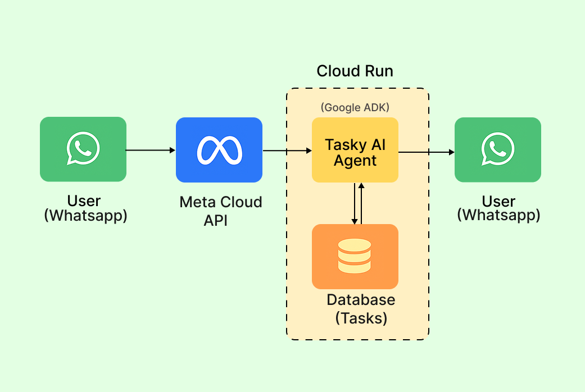
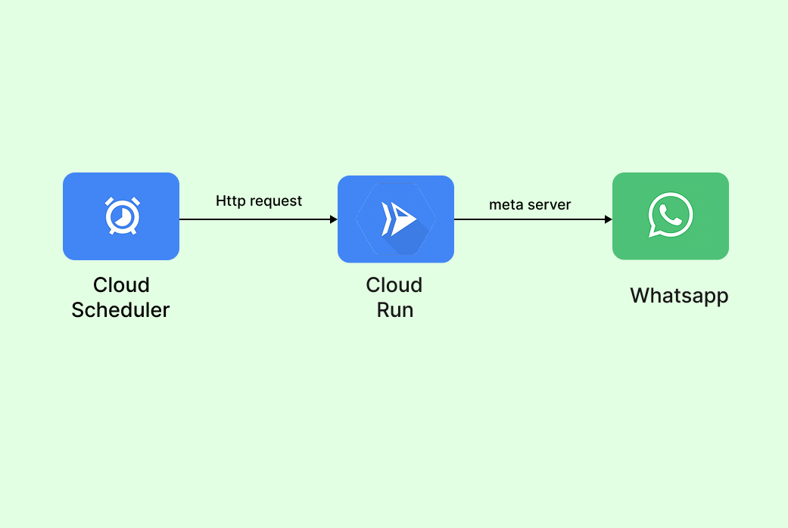

# Tasky AI - Your WhatsApp Task Assistant

A smart AI agent that turns WhatsApp into your personal task manager. Just chat naturally, and it handles the rest.

## The Problem We're Solving

Most people struggle with task management because:
- Traditional to-do apps are clunky and require switching between different interfaces
- People forget to check their task lists regularly
- Creating and organizing tasks takes too much effort
- Voice notes get lost in chat histories
- No one wants to learn another complicated productivity system

We asked ourselves: What if you could manage all your tasks just by chatting with an AI assistant on WhatsApp - the app you already use every day?

## Our Solution

Tasky AI is an autonomous AI agent that lives in WhatsApp and manages your tasks intelligently. You can talk to it like a human assistant, send voice messages while driving, and it understands context to make smart decisions about your schedule.

### Key Features

**Natural Conversation**
- Create tasks by just saying what you need to do
- "Schedule a meeting with the team tomorrow at 3pm" 
- "Buy groceries this weekend - milk, bread, eggs"
- No need to fill out forms or learn complex commands

**Voice Message Support**
- Send voice notes anytime, anywhere
- Perfect for when you're driving, walking, or have your hands full
- Our AI transcribes and understands what you said automatically

**Autonomous Task Intelligence**
- The AI automatically sets priorities based on deadlines and importance
- It suggests when tasks should be done based on your patterns
- Creates daily summaries without you asking
- Remembers your preferences and gets smarter over time

**Works Where You Already Are**
- No new apps to download
- Works on any phone with WhatsApp
- Your data stays secure and private

## How It Works

### The User Experience
1. You send a message to Tasky AI on WhatsApp
2. The AI understands what you want (create task, check schedule, etc.)
3. It makes intelligent decisions about priorities and timing
4. You get a helpful response and your tasks are organized automatically
5. Each morning, you receive a smart summary of your day

### The Technology Behind It
- **WhatsApp Business API** handles all messaging
- **Google Gemini 2.0 Flash** provides the AI intelligence
- **Groq Whisper** converts voice messages to text instantly
- **PostgreSQL with Supabase** stores everything securely
- **Google ADK** manages conversation context and agent behavior

### AI Features
This isn't just a chatbot - it's a true AI agent that makes decisions:
- **Smart Scheduling**: Automatically suggests optimal times for tasks
- **Priority Assessment**: Evaluates what's urgent vs important
- **Daily Planning**: Creates personalized summaries every morning
- **Context Memory**: Remembers your work patterns and preferences
- **Adaptive Learning**: Gets better at helping you over time

## Technical Architecture

### Core Components
- **WhatsApp Handler**: Processes incoming messages and webhooks
- **AI Agent Core**: Uses Google ADK for conversation management
- **Task Engine**: Handles all CRUD operations with intelligent scheduling
- **Voice Processor**: Transcribes audio using Groq's Whisper model
- **Daily Scheduler**: Autonomous service that sends morning summaries
- **Session Manager**: Maintains conversation context for each user

### Tech Stack
**Backend Framework**: FastAPI with async support
**AI Platform**: Google Agent Development Kit (ADK)
**Language Model**: Gemini 2.0 Flash
**Speech Processing**: Groq Whisper Large V3
**Database**: PostgreSQL via Supabase
**Configuration**: Google Cloud Secret Manager
**Deployment**: Docker containers

## Getting Started

### What You'll Need
- WhatsApp Business API account
- Google Cloud Platform account with ADK access
- Groq API key for voice transcription
- Supabase project for database

### Setup Instructions

1. **Clone and Install**
```bash
git clone https://github.com/anemvamsi4/tasky-ai.git
cd tasky-ai
pip install .
```

2. **Configure Environment**
Create a `.env` file with your API keys:
```env
# Google Configuration
GOOGLE_API_KEY=your_google_api_key
GOOGLE_CLOUD_PROJECT_ID=your_project_id

# Database
SUPABASE_URL=your_supabase_url
SUPABASE_KEY=your_supabase_key
SESSIONS_DATABASE_URL=your_postgresql_url

# WhatsApp
VERIFY_TOKEN=your_webhook_verify_token
WHATSAPP_PHONE_NUMBER_ID=your_phone_id
WHATSAPP_ACCESS_TOKEN=your_access_token
WHATSAPP_APP_SECRET=your_app_secret

# Voice Processing
GROQ_API_KEY=your_groq_api_key
```

3. **Setup Database**
```bash
# Initialize the database tables
supabase db reset
```

4. **Run the Services**
```bash
# Start the main chat service
python services/tasky_chat.py

# Start the daily summary service (in another terminal)
python services/daily_summary.py
```

5. **Configure WhatsApp Webhook**
Point your WhatsApp webhook to: `https://yourdomain.com/webhook`

## How to Use

### Basic Examples

**Creating Tasks:**
```
You: "Add buy milk to my task list"
Tasky: "Got it! I've added 'buy milk' to your tasks."

You: "Remind me to call mom tomorrow at 2pm"
Tasky: "Perfect! I've scheduled 'call mom' for tomorrow at 2pm."
```

**Voice Messages:**
```
You: [Voice note: "Schedule team meeting for Friday morning"]
Tasky: "You said: Schedule team meeting for Friday morning. 
I've added this to Friday's tasks. What time works best?"
```

**Checking Tasks:**
```
You: "What do I have today?"
Tasky: "Here's your day:
- Buy milk (medium priority)
- Call mom at 2pm (high priority)
- Team meeting prep (low priority)

Looks manageable! Want me to suggest an order?"
```

## Project Architecture

### Main Chat Flow


```
User (WhatsApp) 
    ↓
WhatsApp Business API
    ↓
FastAPI Web Server
    ↓
Google ADK Agent → Gemini 2.0 Flash
    ↓
Task Management Tools
    ↓
PostgreSQL Database

Parallel Services:
- Groq Whisper (Voice Processing)
- Daily Summary Scheduler
- Google Secret Manager
```

### Daily Summary Flow


The daily summary service runs autonomously, demonstrating our AI's proactive capabilities by automatically generating and sending personalized task summaries without user input.

## Future Vision

We plan to expand Tasky AI with:
- Integration with calendar systems
- Team collaboration features
- Smart notification timing
- Productivity analytics

---

## License

Tasky AI © 2025 by [Vamsi Anem](https://github.com/anemvamsi4) is licensed under 
[CC BY-NC 4.0](https://creativecommons.org/licenses/by-nc/4.0/)

See [LICENSE](./LICENSE) for full terms.